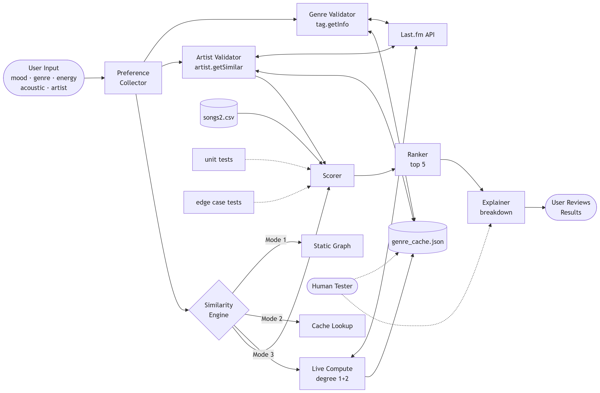
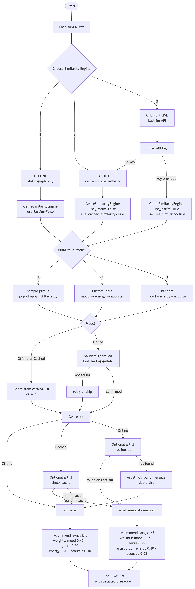

# Final Project: Taste Tuner 2.0
    Explicitly name your original project (from Modules 1-3) and 
    provide a 2-3 sentence summary of its original goals and capabilities.    
  **Background:**
  On week 7 I developed **Taste Tuner**, a music recommendation system, to simulate the algorithms used in "recommended playlist" systems in industry-leading music apps.
  [Taste Tuner 1.0](https://github.com/ipsonicso/ai110-module3show-musicrecommendersimulation-starter) pulls song attributes (particularly *Mood, Genre, Energy, Acousticness*) from a .csv file, takes user text input from a list of predefined attributes, and matches the user with the top 5 songs, ranked by how well they meet the user-set criteria.    

---
## Project Summary
**Taste Tuner 2.0**
### Architecture Overview:

 *System Diagram with Claude (Mermaid.live)*
**System Architecture:** The system allows the user to create a unique taste profile to chekc


 *User Interface Flowchart with Claude (Mermaid.live)* 
**User Interface Experience:** Desc.

### Setup
    
     Setup Instructions: Step-by-step directions to run your code.
    
1. Create a virtual environment (optional but recommended):
   ```bash
   python -m venv .venv
   source .venv/bin/activate      # Mac or Linux
   .venv\Scripts\activate         # Windows
   ```
2. Install dependencies
    ```bash
    pip install -r requirements.txt
    ```
3. Run the program
    ```
    python -m src.main
    ```


### Sample Interactions
  
  
  
  

### Design Decisions
- When brainstorming ways to enhance the system from 1.0, I remembered this website that interested me when I was younger, before I learned how to work with APIs in this class.
- last.fm, a music statistics tracker that aggregates listening habits, trends across big platforms.
**PLAN**
- I decided to design my program for testing with 3 modes
    1) the original iteration of the project
    2) an online version that
        - uses a music aggregator's statistics for live and relevant tag information
        - saves relationships between genres to a local offline dictionary 
    4) an offline enhanced version that
        - uses the offline dictionary for genre information
        - the online version would default to this when not connected or API problems
**Roadblock**
- I remembered I already obtained an API key, but I didn't remember that the most relevant method, *tag.getSimilar*, open to public use was broken and did not match the functioning version on the website.
**Tradeoffs**
- I still wanted to use the API since I knew every other function I tried had worked, so I used Claude to brainstorm possible workarounds.
- I decided that, since artists also have genre attributes, I could workaround by populating songs2.csv with real song data, use a method to get a similar artists, check their tags for overlap, then check those artists' genres for overlap in songs2.csv.
- Not very efficient way to search for genre overlap, but it saves relationships to local dictionary, so there will be fewer api calls with continued use.
  
### Testing Summary 
1) I originally planned to use a useful feature that didn't work (tag comparison), so I used a workaround, importing real song information, approximating stats by the program's metrics, and compare artist tags on artists' profiles instead.
 
### Reflection
  
The AI was great for bouncing ideas off, when I had a good idea, it would give me possible paths to continue down. Still, it was vital to be able to keep it on track and reiterate what I wanted. When I felt at a loss for a technical description, I could give it detailed instructions on how I want it to behave, ask it to repeat its understanding until it matched what I wanted, then have it implement these choices.


### Future Steps

As I continue on this project, my next step is to find a more relevant API to use so my integration is cleaner. Then, I plan to test different likes and recommedations systems.
